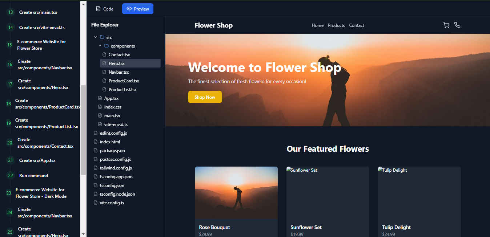

# AI Website Builder

  

*Transform your ideas into fully functional websites with the power of AI.*

---

## Overview

**AI Website Builder** is an innovative tool that leverages artificial intelligence to create stunning, functional websites based on simple user prompts. Whether you're a developer, designer, or entrepreneur, this application allows you to describe your dream website (e.g., "A portfolio for a photographer") and watch it come to life in minutes. Built with a modern tech stack, it combines a sleek React frontend with a powerful Express backend, powered by the OpenAI API for intelligent code generation.

---

## Features

- **Prompt-Based Website Creation**: Input a description, and the AI generates a complete website.
- **Real-Time Code Preview**: View and explore the generated code with syntax highlighting.
- **Live Preview**: See your website in action as it’s being built.
- **File Explorer**: Navigate the generated project structure seamlessly.
- **Follow-Up Refinement**: Iterate on your website with additional prompts.
- **One-Click Deployment**: Deploy your site instantly (configured for Vercel).

---

## Tech Stack

| Technology       | Purpose                      |
|------------------|------------------------------|
| **TypeScript**   | Type-safe JavaScript for robust code |
| **Node.js**      | Backend runtime environment  |
| **React**        | Dynamic, responsive frontend |
| **Express**      | Lightweight backend API server |
| **OpenAI API**   | AI-powered code generation  |

## How It Works

1. **User Input**: Enter a prompt (e.g., "A blog for a travel enthusiast").
2. **AI Processing**: The backend sends the prompt to the OpenAI API, which generates website code and structure.
3. **Website Generation**: The frontend displays the build steps, file structure, and code in real-time.
4. **Preview & Refine**: View the live site, explore the code, and refine it with follow-up prompts.
5. **Deploy**: Export or deploy your website with a single click.

#NOTE >

As it is defpenedent on a third party api of openai sometimes it takes time to get the response because of the server load of openai.
